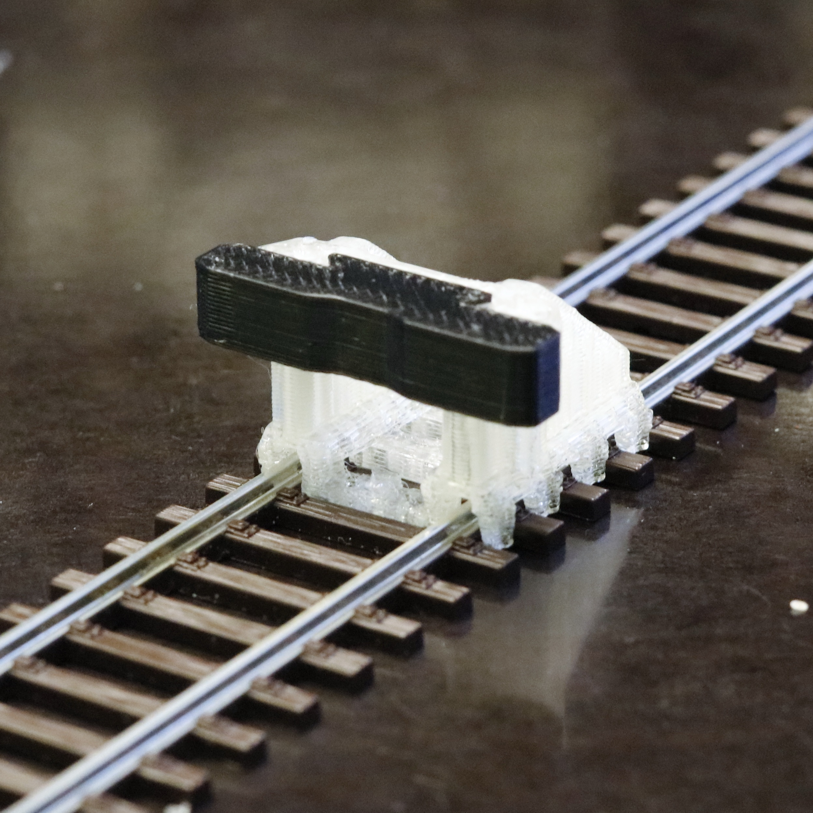

# EtherRail Buffer
3d printable h0 buffer stop made for hidden track sections.

Features
- Real bumper from TPU (rubber like material) prevents breaking of buffers on rolling stock
- Screwable for a firm fit
- Pressure fits in Roco tracks

## Printing Instructions
Download the two models from `models`. We recommend to print the buffer-beam.stl with a TPU material, as it makes trains bump off the buffer instead of breaking their buffers or derailing them. The frame should be printed from a rigid material like PLA. The print settings can be low, the print takes about 15 to 20 minutes.